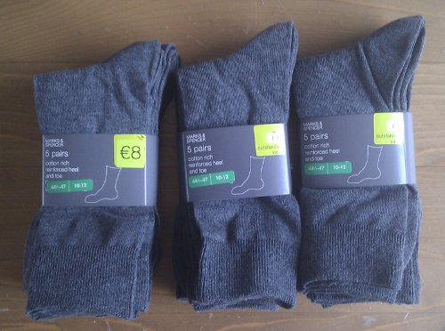

# 15 Identical Pairs Of Grey Socks

## 2012/01/30 10:11

This is a picture of 15 identical pairs of grey socks. Pretty dull - 
right? Wrong! I spend way too much time sorting through odd socks trying 
to pick two matching ones to wear each morning. Being an all-round nerd 
I decided to do something about that. I've just dumped all of the socks I own 
(matching and non-matching) and bought 15 pairs of identical grey socks. 

Let me explain...

1. Why have only identical socks? This should be pretty obvious. Having 
identical socks means you never have to worry about having odd socks.
2. Why Fifteen pairs? I bought 15 pairs so that I'll get some decent 
wear out of them. 15 Pairs should easily last me a year or two. When 
they've eventually run their course I'll dump them and buy another 15 
pairs of identical socks.
3. Why Grey? This one is a no-brainer too. Colors fade in the wash. Any 
color fade will be less noticeable for Grey - it's already pretty much a 
non-color. Other options would be black (but that can fade ) or navy 
(which again can fade so many different shades of blue you end up with 
odd socks anyway). 
4. Why dump your old socks? Out with the old, in with the new. The 
entire point of this exercise is about [optimizing seek time and 
minimizing rotational latency][2]. It's not just enough to have only 
matching socks since that can still take time if the pairs are store 
non-contiguously. Throwing out the old socks (even matching ones) means 
I don't have to think. I just open my sock drawer and pick 2 socks - any 
two will do.
5. Why bother? Because deep down at my very core I am a nerd who just 
can't let things go. Footwear Access speeds were sub-optimal so my 
collection of socks was long overdue a [defrag][1]. Now my sock drawer 
is one single contiguous region and that, dear reader, makes me a very 
happy nerd.

[1]: http://en.wikipedia.org/wiki/Defragmentation
[2]: http://en.wikipedia.org/wiki/Access_time

## Categories
Productivity, Footwear, Defragmentation

