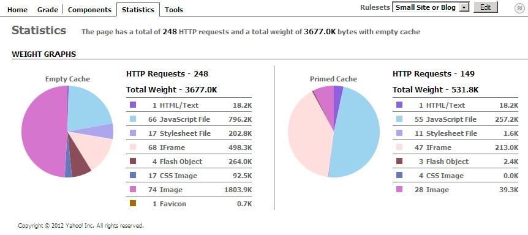
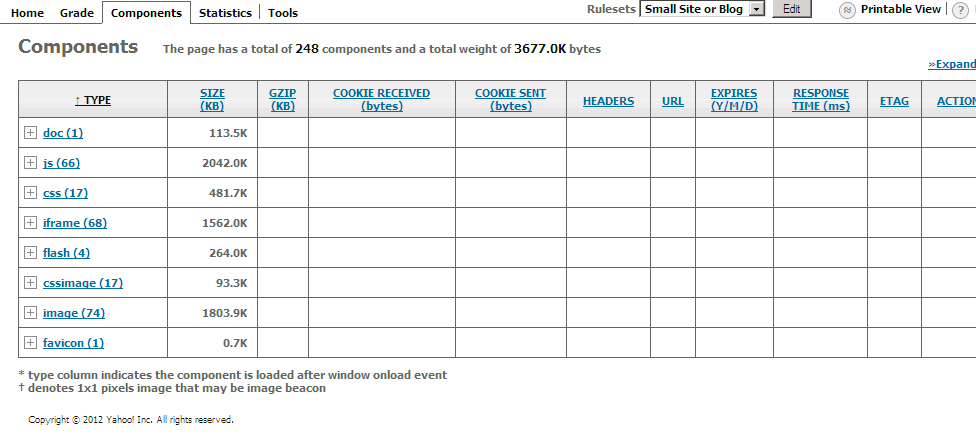
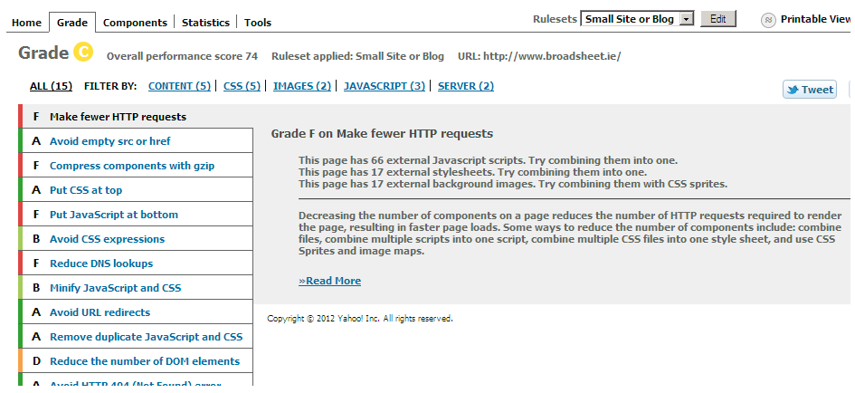
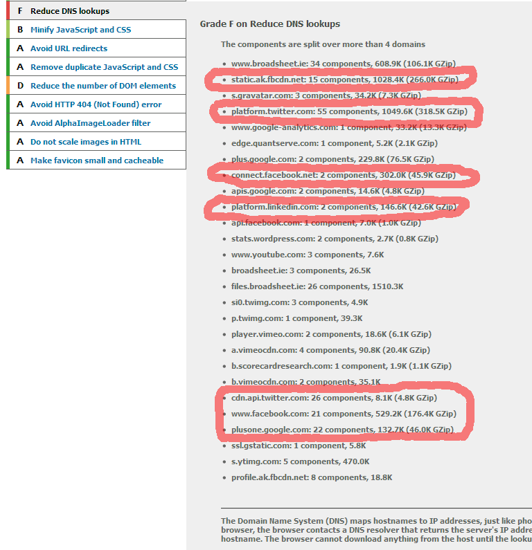

# Broadsheet, Why You So Slow?

## 2012/01/27 16:40

I love my daily dose of [BroadSheet.ie][2] but the page load time is 
ridiculously slow, so I ran website performance tool [YSlow][1] on the 
front page to see just why Ireland's favourite satirical website is so 
bloody slow. The results weren't pretty...

## HTTP Requests - 248

As Broadsheet might say - *"Ah here"*

If you're a techie you can skip to next paragraph. When you type a 
website address in your browser and hit enter, that's one HTTP Request - 
a request to pull content from a web server. The job doesn't end there 
though. The page you request will often pull/request further content 
from the server (Images, javascript code etc) and the page doesn't 
complete loading until all the content it needs is pulled down so the 
browser can display the page. Usually a front page of a website will 
request a dozen or more images, javascripts and stylesheets.

248 HTTP Requests - Seriously Broadsheet? Wow! I wish I could say you 
can see it all on the page but you can't. Most of those requests are for 
content the reader doesn't even see, and has little-to-no benefit to readers 
(and questionable benefit to Broadsheet). Loading up the front page of 
broadsheet will also cost you 3.6 Megabytes of your data plan. Roaming 
is not an option. A good 66 of those requests are for snippets of 
javascript code - mostly from Facebook and Twitter. That's a whole lotta 
Javascript for not a whole lot of benefit to Broadsheet's readers. To 
put this in perspective, [Pixenate][3] uses just 9 Javascript files but 
that's an in-browser photo editor! Also - 68 iframes is fecking 
ridiculous - seriously.

Of that 3.6 MB, half is taken up by images (74 images in total) but I'm 
not going to be a total kill-joy here and suggest they reduce the number 
of images. After all, pictures of [Georgia Salpa kissing Kermit the Frog][6] 
are part of Broadsheet's charm. The pictures stay.

I suspect the reason Broadsheet is so slow is down to the 100 (66+17+17) 
HTTP requests (for Javascript, Stylesheets and background images) it 
makes when you load the front page...

... and the dozens of javascript and image files it pulls from Facebook, 
Twitter, Google - all of them adding social media cruft and clutter that 
makes Broadsheet just a little less readable. The worst offenders are 
highlighted but to be honest the worst offender is Broadsheet itself. 
Someone at Broadsheet needs to call a halt to this and start making the 
site work for readers, not facebook, twitter, google etc. If anyone at 
Broadsheet is reading this - Cut That Shit Out!

In the meantime, the best way to read broadsheet is through a [RSS 
Reader][4]. You can get your regular Broadsheet fix by subscribing to 
[their blog feed][5].

All stats courtesy of [YSlow][1] 

[1]: http://developer.yahoo.com/yslow/
[2]: http://broadsheet.ie/
[3]: http://pixenate.com/
[4]: http://reader.google.com/
[5]: http://www.broadsheet.ie/feed/
[6]: http://www.broadsheet.ie/2012/01/27/kermalpa/

## Categories
Web, Performance, Analytics, Facebook, BroadSheet
