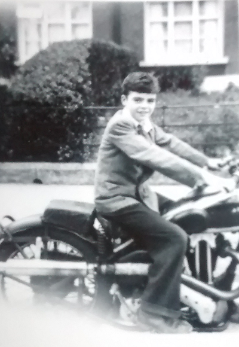
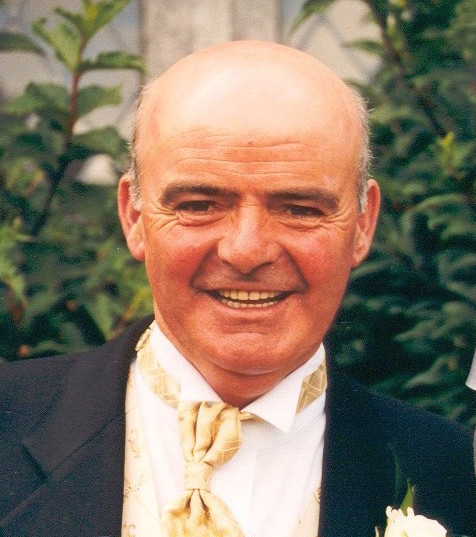

# Paul Higgins 1939 - 2015
## 2015/08/06 19:56

I was 20 minutes into the 3 hour drive to Dublin, just outside Watergrasshill on the M8 when I got the call from the nursing home. It was Janet, the head nurse:

    Hi Walter, are you driving right now?
    Yes.
    Can you pull over?

I pulled in to the hard shoulder and braced for the news. I knew his health was failing, I'd been up to see him with my kids just days previously. He had seemed in better health than I expected, he asked the kids about school.

    It's bad news I'm afraid. He's just passed away. 

I noted the time, it was 11:10 am on an overcast sunday morning. The motorway sign said I was 1 KM from Watergrasshill. He passed away peacefully in his sleep. The nursing home nurses were present by his bed. 

I was 1 kilometer from watergrasshill, 2 hours and 40 minutes away when it happened.

-----------

He was born on September 1st 1939 in Dublin. He grew up in Crumlin, the youngest of 8 - "the nipper". This is a picture of him on a motorbike taken on Saul Road. He was 12 years old. He and my son Sean look uncannily alike.



I had never seen that picture before until yesterday, the day I buried Dad. I love that picture because it surprised me and in doing so reminded me of what I'll miss most about him - he was full of surprises.

The day after a funeral is probably the roughest. I woke up this morning with the distinct feeling that something of me had been buried too. I feel lessened.

One good thing that comes of funerals is the meeting of the wider family. It was great. They are the best. We should meet more often.

This is a picture of my Dad taken at our wedding 15 years ago. He was 60 years old and still in rude health and full of mischief.



He doted on his grandkids Kate and Sean - Always sent them cards and gifts on their birthdays and at Christmas. They took the news hard.

He was a dad, a brother, a husband and a doting grandfather. He'll be missed by us all.   

## Categories
Family
