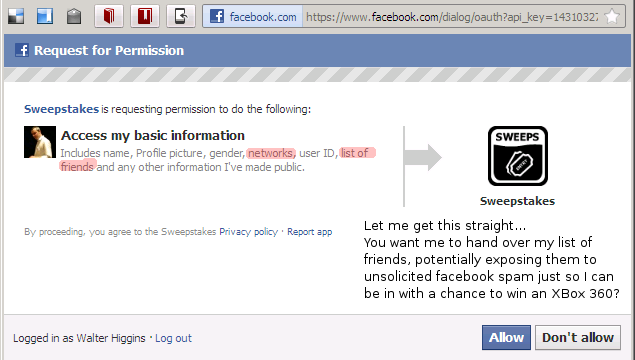

# Don't Allow

## 2012/02/09 13:22

> Want to an Xbox? We're giving one away http://ow.ly/8XwfC (pls RT)
> [blacknight](https://twitter.com/#!/blacknight/status/167545169669918720)

A chance to win an XBox 360 you say? I'd like one of those. What do I need to do?   
Just [visit this page][2] and enter my email address? OK.  
Wait what's this? A Facebook login prompt? OK. I login to Facebook and am then presented with a choice which sums up everything that is wrong with Facebook.

A Request for Permissions by a Facebook App called _SweepStakes_. You want access to my networks and list of friends? Why? Haven't I just given you my email address? Isn't that enough? I'm not above tolerating a little email advertising for a chance to win an XBox 360 (hey - I'm cheap), but do you seriously expect me to give you my friends list so you can potentially advertise to them too?
This is the App developer's [Privacy Statement][2]. Make of it what you will. Needless to say I clicked 'Don't Allow'.

Just to be clear, I'm not singling out [Blacknight][4] here, but there is something insidious in how Companies marketing on Facebook, the Facebook [advertising providers][3], the [Facebook API][5], **and Users** can disingenuously pass the buck when privacy concerns are raised. With all the furore about Path.com, these kind of choices are being made thousands of times every day on Facebook with little thought for the possible consequences.

[1]: http://woobox.com/privacy
[2]: http://ow.ly/8XwfC
[3]: http://woobox.com/
[4]: http://blacknight.ie/
[5]: http://developers.facebook.com/

## Categories
Facebook
