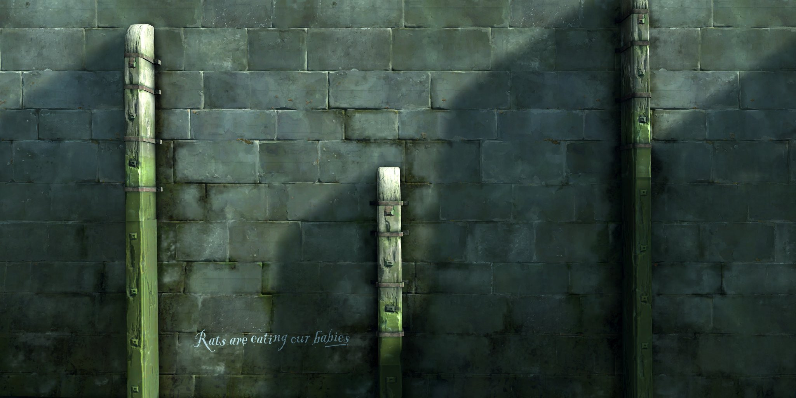

# Dostoevsky's Favorite Game 
## 2019/02/22 18:04


Image Credit: [http://deadendthrills.com/gallery/?gid=92](http://deadendthrills.com/gallery/?gid=92)

> Why am I going there now? Am I capable of that? Is that serious? It is not serious at all. It's simply a fantasy to amuse myself; a plaything! Yes, maybe it is a plaything.
>
> Fyodor Dostoevsky, Crime and Punishment,Part 1, Ch. 2


It feels like the 2012 video game 'Dishonored' and Dostoesvky's 19th century novel 'Crime and Punishment' belong to the same universe. That universe is a moral one. 

In Crime and Punishment the young protagonist (Raskolnikov) plans to rob an elderly Pawn-Broker but in a panic murders the old lady and - when discovered - murders her younger sister too. Fleeing the scene he hides in the shadows to evade two painters working nearby before stealthily making his way back on to the streets of St. Petersburg and back to his grimy student flat. He spends much of the rest of the novel walking the streets of the city wracked by an inner conflict that can't be summed up in a word as simple as guilt. The [streets of St. Petersburg][city] form the backdrop to this inner conflict. The novel's protagonist walks miles along its cobbled streets, rat-infested alleyways and horse-dung strewn avenues, all the while mulling over what he's done and the consequences if he's found out.

[city]: https://blog.oup.com/2017/11/crime-punishment-st-petersburg/

Compare this to Dishonored, a game where you are an assassin (Corvo) tasked with eliminating (by lethal or non-lethal means) a series of villains. Each villain can be eliminated by murdering them outright, by character assassination or by having them banished and living out the rest of their days in obscurity. 

The game does not overtly recommend lethal or non-lethal approaches to eliminating targets but there are consequences to taking the lethal approach - the game has its own moral barometer called 'Chaos' and the world in which the game takes place (Dunwall; a retro-futuristic 19th century industrial city - think Edinburgh, Dublin or London) becomes grimier and more rat-infested the darker the deeds of the player. 

Just like the city of St. Petersburg is a central character in Crime and Punishment, Dunwall is central to Dishonored. The city is a dream - a molten effigy of every northern european 19th century industrial city. It's populated by hard chaws, their faces hewn from rock - malcontents ready to stab or shoot you if you look the wrong way. This is probably one of the best imagined locations I've ever played in. I'm on my 2nd play through of Dishonored - the city oozes character (among other things).

Like Crime and Punishment's Raskolnikov, when playing Dishonored you will often find yourself in situations where you're trying to do the least-wrong thing but are discovered and before you know it you're embroiled in a fight to the death with city guards. A minor misdemeanour (a trespass, a safe-cracking) quickly escalates into bloody carnage and the bodies pile up. In Dishonored there is even a half-senile elderly lady (Granny Rags) who could double as Crime and Punishment's PawnBroker.  

> He suddenly heard steps in the room where the old woman lay. He stopped short and was still as death. But all was quiet, so it must have been his fancy. All at once he heard distinctly a faint cry, as though some one had uttered a low broken moan. Then again dead silence for a minute or two. He sat squatting on his heels by the box and waited, holding his breath. Suddenly he jumped up, seized the axe and ran out of the bedroom.
>
> Fyodor Dostoevsky, Crime and Punishment, Part 1, Ch. 7

Stealth - a constant fear of being detected, morality, and the city itself are intertwined in the video game 'Dishonored' to such a degree, Dostoevsky himself would surely approve.

Read: Fyodor Dostoyevsky 'Crime and Punishment'  
Play: Dishonored


## Categories
Gaming