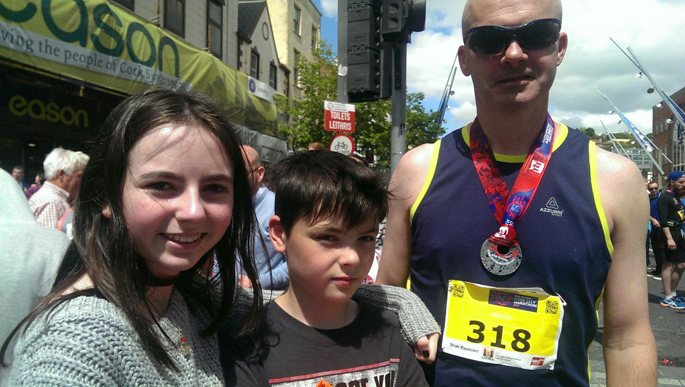

# Marathon Report  
## 2017/06/05 11:25

So I ran my 2nd Marathon yesterday in Cork City. It was a 9am start, beautiful weather, clear blue skies and not as hot (early in the race) as it was last year. In the week leading up to it I had the usual pre-marathon niggles - a calf injury inflicted during last Tuesday's run and a groin strain during a kickabout with Sean on Saturday (you can hear Alan Partridge's sports commentary in your head right now). I woke up Sunday morning wondering if I'd make it through 1 mile never mind 26.

<iframe height='405' width='590' frameborder='0' allowtransparency='true' scrolling='no' src='https://www.strava.com/activities/1021002876/embed/b261249a209902959e6a9b1ae8ad99a6d6e2b871'></iframe>

I woke at 5:45 am and did my usual pre-marathon prep. An early breakfast at 6:00am, some stretching and last minute packing. I put band-aids on my nipples to avoid the dreaded nipple-chafing but forgot about the other parts (more on that later - if you can stomach it). After last year's blistering heat I opted for a single instead of my usual short-sleeve running top. I didn't bother with music this time round. I've stopped listening to music while training the last couple of weeks and haven't missed it as much as I thought I would. Besides, for a Marathon where there's great support from the crowd, running with earphones in your ear means you miss out on all that buzz.

I drove to the Black Ash park-and-ride and arrived in time for the 1st bus at 7:30 am. I was in City Hall before 8am with plenty of time to kill. I hung around for a bit before heading to the start point on Patrick Street where I sound found Conor and Catherine. We took some pictures and chatted for a while before taking our positions in the huddle. I stood a few yards back from the 4:00 pacers. My plan was to keep them in my sights for as long as possible and aim for a sub-4:00 time. That was the plan at least.

<blockquote class="twitter-tweet" data-lang="en">
Top athletes before the carnage of <a href="https://twitter.com/TheCorkMarathon">@TheCorkMarathon</a>  /cc <a href="https://twitter.com/walter">@walter</a> <a href="https://t.co/BdeVGWdEqv">pic.twitter.com/BdeVGWdEqv</a>
&#151; Conor O'Neill (@conoro) <a href="https://twitter.com/conoro/status/871394446587441154">June 4, 2017</a></blockquote>

In a city Marathon with more than a 1000 runners, the first mile will inevitably be slow, I'd planned for that. My first mile was 9:53 minutes but I wasn't too bothered, there was plenty of time and distance to catch up with the 4:00 hour pacers. It was a beautiful clear-skied morning and I was soaking up the atmosphere more so than I had last year. The first few miles flew by (the first in particular - my watch beeped as I passed the first mile and I couldn't believe it) - so much so I was running faster than I'd planned - just under 9:00 minutes per mile. I didn't fret too much about the pace - I was having such a good time. Along the quays by the train station I was admiring the view of the wide river lee and thinking 'This is Glorious'. For the first 8 miles I was on a runner's high. Just completely enjoying the experience of running in a pack on a beautiful morning. The running was easy and a little faster than planned - my fastest mile was mile 6 which I ran at 8:30 pace. Running through the Jack Lynch tunnel is always an experience. The stretch from the tunnel to the Mahon Point off-ramp seemed longer than I remembered but I was still comfortable and on pace. I got running in lock-step with and talking to another runner who was also aiming for sub 4:00 and it was also _his_ second marathon. We chatted for a while and actually stayed pretty much in lock-step from mile 8 through mile 14.

The first minor glitch happened as I was nearing the 13 mile mark. There's a short ramp leading up to a pedestrian overpass on the M8. I grabbed a slice of orange and sucked on it as I started up the ramp. By the time I'd reached the top of the ramp and discarded the orange skin, I was short of breath and my legs hurt. It only lasted a couple of seconds but it was the first discomfort I felt on the run. I was still on target and even caught up with one of the 4:00 pacers. Along the old railway stretch of the route I began to lag behind the pacers. I was still running and chatting with my fellow 2nd-timer but decided I needed to push on a bit faster to catch up. This is when slowly but surely my hopes of a sub-4 marathon began to dissipate. By the time I got back on to the Marina the 4:00 pacers were nowhere to be seen. I forged on ahead. I was still doing 9:15 and 9:30 miles now so hope wasn't entirely lost.

In the fortnight leading up to the race I'd planned some landmarks and times I needed to do a sub-4:00 marathon. The 10 mile mark was along the blackrock road and I'd need do it in 1 hour 31 minutes and 30 seconds. The next landmark was 16 miles at Lapp's Quay. I'd need to be there by 2:26:24 to stay on target, after that 20 miles just beyond the Lough at 3:03:00 then 23 miles on the Curraheend road and home. Breaking up the Marathon into 10, 16, 20 and 23 sections made it more manageable in my head. I knew I could _race_ 16 miles because I'd done 2 point-to-point races of similar distance in the last couple of months. I didn't tick off the miles because there were too many and if I thought about it too much it would be overwhelming.

At the 16 mile mark I looked at my watch. 2:29 - I was just 3 minutes off of my sub 4:00 target at that stage. As I ran up the south link road, I knew what lay ahead - a viciously steep corkscrew on-ramp on to Turner's Cross. On the approach I was repeating aloud a mantra I'd promised myself "Do not walk. Do not walk.". A runner alongside me said "If it's all the same to you, I think I'll walk this part". I can't say I blamed him - the onramp is steep. I ran it and was out-of-breath as I turned on to Turner's cross. By now I was running with effort. The support from the crowd through Turner's Cross and Togher was great but the hills - my god the hills. The route this year changed to avoid churches and sunday mass so much of this stretch was unfamiliar. I just remember having to repeat my "Do not walk" mantra many times through Togher.

At mile 19 disaster struck and I had a pretty severe stitch in my right leg (the same leg I'd injured _twice_ in the days leading up to the Marathon). It was so severe I had to stop and stretch for a minute before gingerly taking off again. At the Lough there was great support from the crowd. A water station, sponges, and a friendly local with a garden hose set to 'mist' was just what I needed. Another boost was catching co-worker and fellow runner Irene in the crowd (she'd planned to run the relay race but had to cancel). I'd seen Irene and her family near the 10 mile mark earlier. I'm pretty sure my form wasn't as good at the 19 mile mark. I was dimly aware of some chafing on my right big toe and on my arms but it barely registered as a background niggle.

At the 20 mile mark spectators were chanting bib numbers to egg us on - our bibs didn't include names this year (something I think needs to be fixed next year). "318! 318!" they chanted as I approached. I have to say the support from spectators *MAKES ALL THE DIFFERENCE* when you're running a Marathon. I feed off of it as I'm sure other runners do. Kids holding out their hands to be slapped by passing runners, spectators with jelly babies, sliced oranges and sweets. The cheers. *IT ALL HELPS*. It's something I enjoyed and needed much more this year than last year. Last year I ran with Music and earphones and missed out on this important aspect.

It was downhill towards Farmer's cross but I knew I'd be paying for this easy downhill section shortly. We were heading towards another rerouted section - a long uphill stretch at Faranlea Road, Faranlea Park and on to Model Farm road. As I headed up Faranlea Park I heard a friendly "Hello" from Brendan, a former colleague. Brendan is a fast runner and was doing 2 sections of the relay race. "How's it going?" he asked. I can't even remember what I replied. "Come on! This is the last hill." he said. "I probably shouldn't be trying to keep up with you - I've seen your strava runs" I replied. "Stay with me til the top of the hill then, and I'll push on". So I did. Brendan was a life-saver at that point. You need all the support you can get.

The downhill stretch of the Model Farm Road was the only thing keeping me running. The promise I made to myself to not walk now had a sub-clause "do not walk except at water stations". It was past noon now, the day was heating up and my legs were exhausted. As I turned on to the Curraheen road I tried to pick up speed - this is a road I often run along in training so I knew there were just 3.2 miles left. Pretty soon I was walking again, right up to the point where the 4:15 pacers passed me out along the Lee Fields. "Uh oh" I thought - "Can't let that happen". I started running again and stuck with the 4:15 pacers right up until the Kingsley Hotel where my legs failed me again and I just had to walk. I must have walked the whole stretch from the Kingsley up to the Mardyke Arena before taking off again. By now the 4:15 pacers were out of sight. I was surrounded by people walking and shuffling their way along, just like me. It's super easy to stop running and just walk when your legs are tired and you're surrounded by walkers. It takes real force of will to keep running - will which I just didn't have on the day. Things weren't as bad as last year but still, I had promised myself I wouldn't walk no matter what and I'd broken that promise.

They say the last 6.2 miles is equal in effort to the first 20 miles and that felt true. In truth though, yesterday's Marathon also felt easier than last year's. In many ways this feels like my first - not second - Marathon. It's the first Marathon I truly _raced_. The first where I just wanted to finish the damn thing as quickly as possible. The 15 mile and 25k point-to-point races I've done since my first Marathon have given me a sharper more competitive edge. Last year's Marathon training didn't go to plan - I ramped up too quickly and too early and got injured, so I was holding back on the day just hoping to complete it without further injury. This year the training went better - I didn't hold back - I was racing not just participating.

Mile 26 began with a walk but shortly after crossing the Mardyke Bridge I began running (well - jogging) again and continued to do so for the rest of the race. This was it - the final stretch. "You can do this" I repeated to myself "Do not walk!" I said to myself as I ran along Wise's Quay and crossed the bridge on to North Main street. This was another stretch which was part of a reroute. North main street normally isn't the most picturesque of Cork city streets but I was glad to see it: the final stretch - nearly home. The street has cobbled speed ramps which didn't cause too much of a problem (for me at least). I looked at my watch about halfway up North Main street - it read 4:15:00. My head was foggy but I was pretty sure I could finish in under 4:20 barring any catastrophes and this gave me a bit of a boost. North Main street was lined with spectators cheering and the noise of the crowd became progressively louder as we turned on to Washington street, the Grand Parade and then Patrick Street. Patrick Street is Cork's main street. In previous years the finish line was about half way up the street and you'd arrive there from the opposite end of the street (turning Right on to it from Lavitt's Quay). I got it into my head that the finish line was nearer the west end of the street (near Carey's Lane) and so started my final kick as I turned on to Grand Parade. As it turned out the finish line was much further east (east of Opera Lane) - still I kept going. Soon I could see the finish line and the clock read 4:18:49. I sprinted to the finish to get in just under the 4:19:00 mark (even though I knew the clock time was meaningless - I had a chip and a GPS watch). That last mad dash for the finish took more out of me than I imagined.

I crossed the finish line and as soon as I did I felt a strange pain across my shoulders and upper arms. I stopped my watch at 4:17:42. I shook my arms and stretched them above my head. I'd really given it my all for that last stretch and final dash and as soon as I stopped the overriding pains in my legs were replaced by other pains I had barely noticed. My arms were badly chafed and the blister I'd felt forming around the 20 mile mark was now screaming for attention. Alongside all of this was the most incredible feeling - a feeling of accomplishment and euphoria. The whole experience while it lasted was properly overwhelming. I began looking for Ursula and the kids in the crowd but couldn't see them. Within yards of the finish line I stopped to lean against a table and just gasped for breath. Two women either side of me were catching their breath too. The finishing area was a good 100 yards or so and I knew I had to get water and something to eat. There were tables covered in Chocolate bars and Water bottles. I grabbed a water bottle and saw the Banana table just a few yards ahead. I grabbed one, clumsily skinned it and wolfed it down with some water. I was starting to feel better already. 4:17:42 That's a time I could live with. I was happy. I rang Ursula to see where she was - they'd gotten caught up in Marathon traffic reroutes and were on North Main street but would be on Patrick Street in 5 minutes. I'd suggested they be there for 1:15pm (assuming a 4:15 time - I'd had 3 times in mind 4:30 , 4:15 and 4:00 and figured it was best to tell them the median time - I didn't want them waiting too long if I didn't make the 4:00 pace).

While I was waiting for Ursula I saw Kelson - another work colleague - finish. We'd passed each other once or twice around the 8 mile mark. "How did you do?" I asked. "Happy enough - under 4:30". I was pleased for him - pleased for everybody actually. My first Marathon had felt much more like a solo affair - maybe it was the earphones but I didn't relish and savor the experience as much as I should have. This time was different - it felt much more like a communal experience. I was genuinely happy to see even passingly familiar faces. Ursula and the kids showed up just as I wished Kelson farewell. We took a picture of me and the kids.

Now came the post-race logistics. Where to grab lunch with Ursula and the kids. But first I had to shower and change clothes. Joe - another colleague - had tipped me off about post-marathon showers in the Clayton hotel - it was just across the river from the baggage drop in city hall and for 5 euro you could avail of their changing rooms and showers. I said I'd meet Ursula and the kids again in a few minutes after I'd showered and changed and then we could figure out where to eat. I picked up my bag from City Hall and headed over to the Clayton. There were plenty other Marathon runners there. The Mens changing room was busy. I hopped into a shower and began washing. That's when I realised just how bad my chafing was. I stupidly hadn't put body-glide or anti-chafing cream on before the race and as I started cleaning my - let's say - sensitive bits I realised just how bad the chafing was. Let's just say I emitted a short high-pitched involuntary squeal - one that must have had the all-male attendees wondering if a girl was in the men's showers. I finished up and - very tenderly - dried myself off, got changed and swore to stock up on body-glide next year. 

I headed out back towards Patrick street and by now the knees were starting to feel like jelly already. I was feeling that exquisite long-run pain in my ankles and knees and was already walking like John Wayne - as were many others. The city center was buzzing with post-marathon activity - many of the runners now cooling off outside bars with pints of beer. I caught up with Ursula and the kids and we decided to go for Chinese in Yuan Ming Yuan - a favorite of ours - they do great dumplings. As I turned off Patrick street I spotted Conor approaching the finish line - he was running strong. I ran over to the barrier to cheer him on but I'm not sure he heard me. We headed on up towards Princes Street and opted for seafood in Quinlans instead. It was good to finally sit down and rest. My legs were aching but I was still basking in the feeling of accomplishment. Lunch with the family was the perfect end to a good Marathon - another difference from last year when I could only spend a little time with the family because our eldest was heading to Waterford for a 3 week stay in the Gaeltacht.

This felt more like a Marathon - everything went better, the training, the weather on the day, the race, support from the crowds and little moments along the way. And of the course the Finish which felt incredible compared to last year's damp squib. It was properly overwhelming. I'm already considering when my next one will be.

## Categories
Running