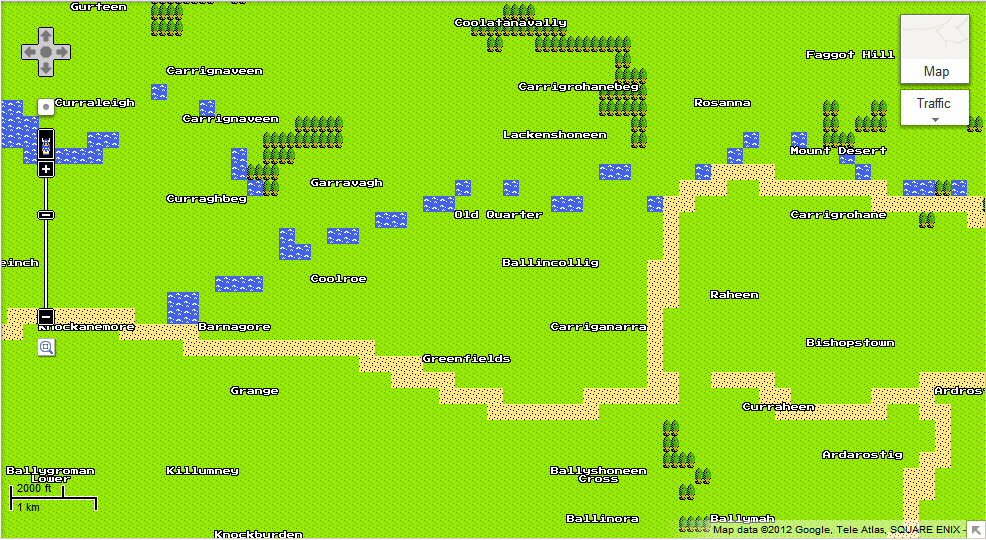

# Welcome to Middle Earth, Cork
## 2012/04/01 09:49

For April Fool's Day, Google have done something very special and 
created [8-Bit map tiles for google maps][1]. Anyone who has played 
Zelda will love it. This is a map of where I live - Ballincollig is slap 
bang in the center, the 8-bit maps are (sadly) only available at 
town-level resolution, otherwise I'd be able to see my house and nearby 
green in glorious 8-bit splendour...



... Those place names...

 * Coolatanavally
 * Faggot Hill
 * Carriganarra
 * Mount Desert
 * Garravagh
 * Old Quarter
 * Carrignaveen

... They're not made up - though they sound like names dreamt up by 
J.R.R. Tolkein. One of the cool things about living in Ireland (outside 
of Dublin) is you look at a map and can pretend you're living in Middle Earth.

[1]: http://maps.google.com/?t=8&utm_campaign=8bit&utm_source=yt
## Categories
Cartography, Maps, Google, April Fool, Cork