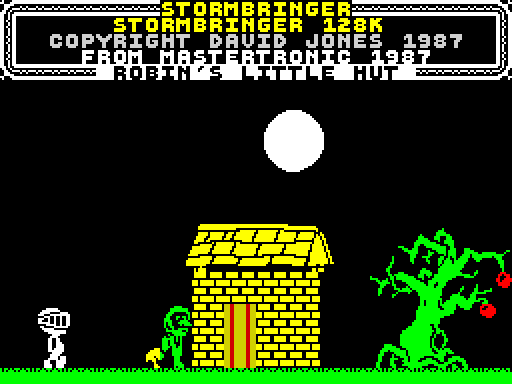
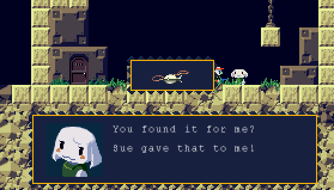

# Stormbringer & Cave Story
## 2012/01/17 18:04

I started playing Cave Story (more on this soon - maybe) last night and 
was reminded of a game I played 25 years ago - [Stormbringer][4]. I spent 
endless hours playing Stormbringer and never got very far in it but I 
didn't mind so much because the game was so engrossing with its odd-ball 
characters and settings. It had a gnomic internal logic I never figured 
out but I loved its quirkiness. It was an 'Adventure' game of sorts but 
aided by an on-screen menu of options so you never had to guess what 
verbs/nouns to use when interacting with characters and puzzles. It 
obviously made a big impression on me because I still remember it to 
this day but only just recently recalled the name 'Stormbringer'. For 
years I had remembered it as 'that game with the big-headed knight who 
hops about'. 

What prompted this recollection was [Cave Story][5]. I've been playing 
the Demo version on the Wii. I first played it a few months ago. Back 
then I didn't play it very long and didn't get very far. Last night I 
decided to give it another go. It's on sale on Steam right now (6.99 for 
mac version) and seems to have received [universal praise][1]. Even 
Michael Abbott [has written about it][1] ([twice actually][2]) so 
needless to say it's worth a look. My early impressions of it are that 
it's *way* too difficult and I can't overlook having to return to the 
start of each level when I die and read all the JRPG-inspired dialogue 
over and over again (Save points in Arthur's House and the Computer room 
in Egg Corridor would be helpful). In that respect it seems to be a 
"gamer's" game. I'll give it another bit of time before buying. That 
might seem miserly to some, given that the game is cheap and it's an 
indie game developed by one guy, but if I like the game I'll buy it.
Update: I played some more tonight and am still not convinced of its 
brilliance. Having to go back to the very start when I get hit by the 
white flash in the Egg Corridor is a major pain.

[1]: http://www.metacritic.com/game/wii/cave-story/critic-reviews
[2]: http://www.brainygamer.com/the_brainy_gamer/2010/03/the-cave-story-story.html
[3]: http://www.brainygamer.com/the_brainy_gamer/2010/04/a-dark-cave.html
[4]: http://www.worldofspectrum.org/infoseekid.cgi?id=0004919
[5]: http://www.cavestory.org/

## Categories

Gaming, Cave Story, Stormbringer, ZX Spectrum, Wii
