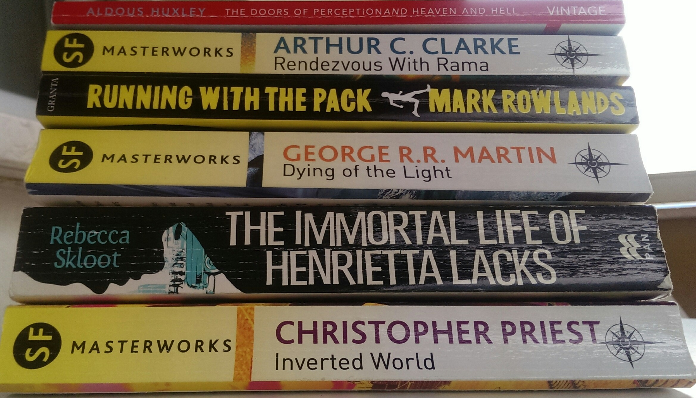

# Summer Reading 2017

## 2017/07/28 15:38



I love the feel and look of books after they've been read. Just look at the creased spines in the above photo. I love how the spine of a book creases and slants after it's been read on a beach or by a pool - the patina of a quickly-read book that's weathered sun and the odd splash of water and sun-cream. All of the above books were recently purchased new and after just 2 weeks they look aged - I like that.

## Aldous Huxley: The Doors of Perception / Heaven and Hell
This was one of those books I read in my teens. I thought I'd give it give it another spin. This is a first-hand account of Huxley's first experience with Mescalin and what would come to be known as the Psychedelic experience. It's a short read - just 120 pages or so. I started reading it in Cork Airport on Saturday morning and finished it on the coach from Verona to Lake Garda that afternoon. 

## Arthur C. Clarke: Rendezvous with Rama
I love reading science fiction on holidays. If you're looking for a book to read while soaking up the sun and recharging the batteries, this is the perfect book. Clarke is a master of this genre - he can walk you through the impossible like it's the everyday. He's concise too - Rendezvous is a short book. Clarke can say in 250 pages what lesser writers might need 800 pages to say.

## Mark Rowlands: Running with the Pack
Rowlands is a philosopher who adopted first a Wolf then a small pack of dogs with whom he runs. If running and the reasons why people run is your thing, you'll enjoy this. 

## George R. R. Martin: Dying of the Light
This was Martin's first (and only?) science fiction novel. It's set on a dying world where Winter is most definitely coming and features a race not unlike GoT's dothraki. There's a brutal hunt involved too. It's not as enjoyable (or readable) as his GoT books but it passes the time.

## Rebecca Skloot: The Immortal Life of Henrietta Lacks
This is a non-fiction account of the life of Henrietta Lacks and her family. She was a black woman who died in 1951 and whose cancer cells (taken without her informed consent) have become a multi-billion dollar industry. She and her children have lived in poverty and haven't seen any material benefit. This is a tough read - I mean it's readable, but it's grim reading. It will make you angry.

## Christopher Priest: Inverted World
More science fiction. This is quite good - it builds an improbable microcosmic world and has a twist ending. It's well written too so I'll probably seek out more of Christopher Priest's work (along with Arthur C. Clarke's).



## Categories
Books
