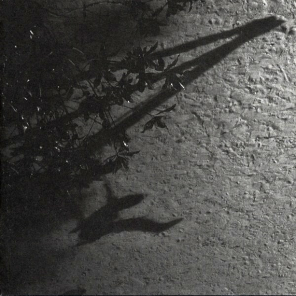

# The Blue Notebooks

## 2011/10/21 16:35

> A longing to wander tears my heart when I hear trees rustling in the 
> wind at evening. If one listens to them silently for a long time, this 
> longing reveals its kernel, its meaning. It is not so much a matter of 
> escaping from one's suffering, though it may seem to be so. It is a 
> longing for home, for a memory of the mother, for new metaphors for 
> life. It leads home. Every path leads homeward, every step is birth, 
> every step is death, every grave is mother.
> 
> So the tree rustles in the evening, when we stand uneasy before our own 
> childish thoughts: Trees have long thoughts, long-breathing and restful, 
> just as they have longer lives than ours. They are wiser than we are, as 
> long as we do not listen to them. But when we have learned how to listen 
> to trees, then the brevity and the quickness and the childlike hastiness 
> of our thoughts achieve an incomparable joy. Whoever has learned how to 
> listen to trees no longer wants to be a tree. He wants to be nothing 
> except what he is. That is home. That is happiness.  
> -- [Hermann Hesse](http://www.goodreads.com/author/show/1113469.Hermann_Hesse)

Max Richter's *The Blue Notebooks* is not an album I could have loved
as a younger man. I'm not even sure I love it now. Like all music that
has touched me profoundly, I came to it by pure happy accident - by
which I mean I can't recall how I came to it so it must have been
accidental.

How to describe the music on The Blue Notebooks... It is classical
ambient. It is unfussy but powerful. Autumnal. The perfect music for
this time of year. Some of it is heart-breakingly beautiful...

[Vladimir's Blues](http://youtu.be/6TqV986mOm8)

... some of it quietly uplifting...

[Horizon Variations](http://youtu.be/gFgv9WpbnyE)

... It is the rarest of things - a perfect album. I was walking in the
Lee Fields in Cork on sunday evening. The sun was setting behind the
hills near ballincollig, the air was crisp and the path strewn with
leaves. The river lee bubbled and eddied as two swans swam near the
bank. It was the perfect time of day and year to listen to The Blue
Notebooks. I'm so beguiled by this album that I'm afraid to check out
Max Richter's other work for fear the spell this has cast on me will
be broken. 

## Categories

Music, Max Richter
