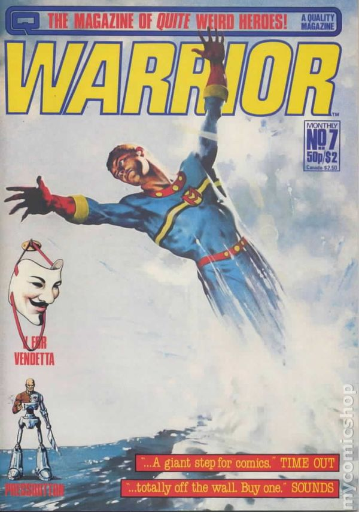

# Un-Scene

## 2017/04/04 07:01

On a rainy cold Saturday morning in March 2017, thousands of people
queued for hours in the cold to gain entrance to a Gaming
Convention. They'd paid a lot of money to attend and many of them
didn't get in. The venue could only accommodate 9,700, the conference
organiser sold 25,000 tickets. That's Dublin and Irish
ah-sure-it'll-be-grand Entreprenurialism for ya.

Inevitably there was a Social Media Backlash&#153;. I wasn't one of
those attending but a friend had asked would I be interested in
going. It was a Video Gaming Convention and although I _play_ video
games, the thought of attending a conference devoted to video gaming
does not appeal.

The sight of 1,000s of parents and kids queueing in the cold and the
rain that Saturday morning brought me back to Saturday mornings more
than 30 years ago. Dublin was very different then (we didn't have a
Convention Center affectionately known as 'The Tube in the Cube', and
we didn't have commercialy-run Video Gaming Conferences that scalped
paying customers). I think 30 years is a suitable time for
reminiscing. The 80s is now a long time ago. To my kids it seems
prehistoric.

Temple Bar in 1985 wasn't too different to now. It wasn't yet the
stag-night goto it became in the mid to late 90s. Some of its
landmarks have been there since before I can remember. The Bad Ass
Cafe, the record and camera shops, the older pubs, the Project
Theatre. There were also a lot more comic shops back then, and of
course there was The Alchemist Head - a mecca for anyone who read
science-fiction. The Alchemist Head was a small single-story bookshop
on Essex street just across the street from the Project Theatre. It
kept odd opening hours if I recall correctly - it sometimes didn't
open until after 10:30 am. I remember waiting outside and peering
through the shop window where the latest books by Douglas Adams and
Brian Aldiss were on display. There were also posters on the walls -
the iconic image of Harrison Ford clinging on for dear life from a
metal beam in Blade Runner.

What brought me to The Alchemist Head wasn't books but a selection of
new and second-hand comics they sold. I'd often go rifling through the
2nd-hand section looking for old issues of 2000AD. I'd occasionally
pick up an issue of 'Epic Illustrated' - Marvel's "adult" imprint,
which featured stories by Alan Moore and others. As far as I know, The
Alchemist Head was the only place in Dublin that sold 'Epic
Illustrated'.

A visit to The Alchemist Head became a regular Saturday pilgrimage
throughout 1985 and 1986. I think it closed down sometime late in 1986
and reopened a couple of years later on Dame Street but it was a
different type of bookshop selling mostly self-help, occult and other
speciality books. There were other shops scattered around Temple Bar
which sold Comics - there was a shop just alongside the Central Bank
with a great selection of new and second-hand comics. I can't for the
life of me remember its name but it was also a regular haunt.

Away from Temple Bar on Anne street just off Grafton Street there was
of course The Diceman - a game store which specialised in Role-Playing
Games. It was - as far as I know - the only dedicated RPG store in
Dublin. The Diceman store is less famous than its Mascot - The
Diceman. The Diceman was a mime artist on Grafton street throughout
the 80s whose job was to advertise the store. He was so entertaining
that he kind of became famous in his own right. Unfortunately I think
he succumbed to AIDS some time ago.

The Diceman store occupied an old georgian-style building on Anne
street. It had a selection of Board Games and wooden toys on its
ground floor but downstairs in the basement was where all the good
stuff was. The basement was poorly lit and smelled of Incense (I
think) but it had everything a 14 year old RPG fan could ever
want. Metal Figurines, every RPG you could think of - Dungeons &
Dragons, Advanced Dungeons & Dragons, Traveller and many more. There
were metal figurines and paints too. All of the RPG supplements and
magazines (White Dwarf etc). The same music seemed to always be
playing - I vividly remember hearing Billy Idol's "Dancing with
Myself" more than once during the same visit.

The Diceman too was not long for this world and closed down not long
afterwards. I remember missing those stores - I still do.

Just a few doors up from the Diceman was another 2nd-hand book shop -
god there used to be so many of them in Dublin. That's where I chanced
upon a horde of 'Warrior' magazines. I was big into 2000AD at the time
and 'Warrior' was - like 'Epic Illustrated' - aimed at the more mature
reader. It shared many of the same writers and artists as
2000AD. 'Warrior' was where Alan Moore's "MiracleMan" and "V for
Vendetta" were first published. By the time I discovered 'Warrior' it
had already ceased publication. It ran from around 1982 to
1984/5. Unlike 'Epic Illustrated' , 'Warrior' was not full-color but
the writing was great - even better than its American counterpart.

Shortly after my daughter was born, in a fit of nostalgia I bought
full sets of both 'Epic Illustrated' and 'Warrior' on eBay. This would
have been around 2002 - FIFTEEN years ago now! I still have those sets
- each issue in a plastic cover - though to be fair I didn't buy them
in Mint Condition (I'm not _made_ of money) and only bought them to
re-read and satisfy my nostalgia.

What's prompted all this reminiscing? I sometimes fervently wish I
could go back to that time. The book, comic and game shops of my youth
are gone for good. On a recent trip to Dublin I drove down Cork street
and the Coombe where there was once a shop that sold 2nd-hand comics -
you could get real bargains there. Even though the Coombe has changed
a lot the store's building was still there but boarded up. Walking
down Grafton street I peered along Anne Street but the Diceman sign
was not there. I didn't bother to go see what was in its place.

I don't miss Dublin or the 80s per se, just that nebulous time and
place when there were things to do and places to go that were just a
little off the beaten path.

## Categories
Gaming, Nostalgia, Dublin, 80s
