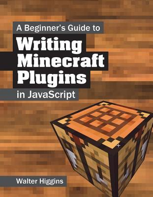

# Writing Minecraft Plugins: The Book
## 2014/09/26 08:41

I wrote a book.



I wrote a book to teach Javascript Programming. The book is aimed at beginners of all ages. It's a technical book but assumes the reader has no programming knowledge. The book teaches Javascript and how to use it to create Minecraft Plugins.

It was due to be released this November but recent developments in the world of Minecraft Modding - the CraftBukkit DMCA takedown notice to be exact - mean the book's release date  has been postponed. 

The book requires you to install ScriptCraft so readers can write Minecraft Plugins using Javascript. ScriptCraft in turn uses CraftBukkit which is no longer available due to legal reasons. This means I have to port ScriptCraft to another modding framework, update the source code listings in the book and the accompanying text. I've already begun this process. I'm currently working on porting ScriptCraft to work with CanaryMod, a Minecraft server which supports plugins. The ScriptCraft port is going well though it's not yet complete. I honestly don't know how long this will take. It might take as little as 1 month or as much as 3 months.

The book was in production copy review phase (I was reviewing final production PDFs) when the news about CraftBukkit's takedown notice broke. Writing the book has taken a long time and a lot of work. When I heard about the takedown notice I contacted the publisher to let them know. In a way I'm glad the takedown didn't happen later because publishing a book which includes download instructions for software which is no longer available would not have been good for anyone: readers, the publisher or myself. 

To say I'm disappointed about the postponement is an understatement. I *love* technical books - actual physical books - and to be able to say I wrote a Javascript book ... well that was something I was proud of. I was *really* looking forward to the book's release. It's a full-color book with lots of supporting diagrams and screenshots, printed on high quality paper. It's the kind of book *I* would love to read if I were 12 years old and interested in Minecraft and modding.

Anyway, the book's release date is postponed for now - I hope it will be available soon. I'm working on it.

## Categories
Minecraft, ScriptCraft, Writing