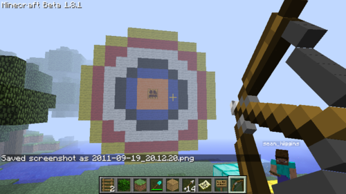
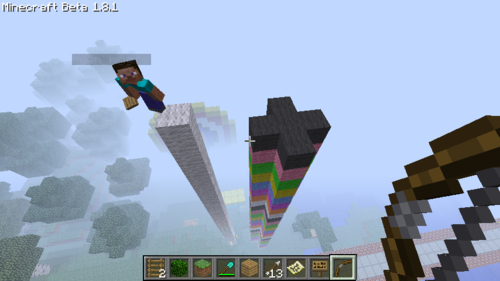
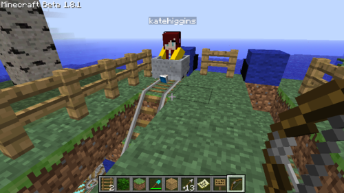
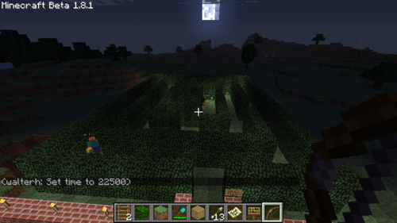

# Minecraft: games within games
## 2011/09/19 12:32:44 
More than one year on and Minecraft still delights. This game is 
something really special. Playing multi-player with the kids has 
revealed new depths of fun / imagination.

Archery in Minecraft (this was Sean's idea, I made the target)

Platformer in Minecraft (this is Sean's game - he's a big Super Mario fan)

Kate's Rollercoaster challenge.

Playing hide-and-seek in The Moonlit Maze.
All of these games were created within the game. The Moonlit maze is my 
creation, all other games were made up by the kids.
## Categories
minecraft, 