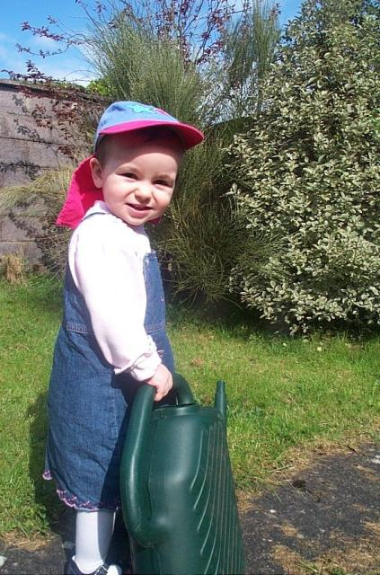

# Weblogs as Gardens
## 2003/07/16 12:00

I was working on the site until 2am this morning trying to make it
look good under Internet Explorer 5. Not being a web designer as such,
I spent a few hours fumbling with 'padding' 'margin' and 'border'
<abbr title='Cascading Style Sheets'>CSS</abbr> properties until I
finally arrived at a solution that (I hope) looks OK under IE5 and
other browsers. Basically, the tabs looked <a
href="/images/misc/ie5.png">crap</a> in IE5 <a
href="/images/misc/nn6.png">compared</a> to all other browsers.Anyway
the offshoot of all this was that I spent far too much time tinkering
with <abbr title='Cascading Style Sheets'>CSS</abbr> last night. I
woke up this morning with the thought that my website (as with most
weblogs or personal websites) is like a private back garden. 

Company websites are like Corporate Lobbys, they are outward facing,
designed to impress and to sell. Most weblogs don't have a commercial
agenda, they're not trying to sell you something. They are places that
invite people to drop by or hang out. I think the back garden analogy
is a good one. Weblogs come in many guises. There are prefab'd
astroturf <a href="http://blogs.osafoundation.org/mitch/">pitches</a>
where the dictum 'Content is King' is brutally adhered to, and there
are well tended gardens where the owner has tried to create a pleasing
blend of style and content.

Cristopher Alexander's <a
href="http://www.amazon.com/exec/obidos/ASIN/0195024028/xanajavaperle-20?dev-t=D3EAQGRBM3NMZM">The
Timeless Way of Building</a> is a eulogy to how buildings and places
used to be built - by the people for the people. Alexander went on to
classify common patterns or themes in pre-industrial-age
construction. His classification of patterns caught fire in the
software industry in the late 90s and nowadays there are <a
href="http://www.amazon.com/exec/obidos/ASIN/0201633612/xanajavaperle-20?dev-t=D3EAQGRBM3NMZM">'Patterns'</a>
for pretty much any IT-Related topic ... So ... I'd like to propose a
first tentative pattern for weblogs ...

> *Garden by a babbling stream*: The garden (infrequently updated content,
> authored by the blogger himself) is adjoined by a stream (one or more
> frequently updated news feeds).
> 
> This pattern resolves a number of tensions. The author (myself in this
> case) is too lazy or too busy to post stories every day, yet envies
> the constant churn of postings and commentary on other weblogs. This
> problem is solved by the addition of a number of newsfeeds placed
> discretely on the website. The website is constantly updated without
> effort from the website author. 
> 
> The website becomes a portal for interests common to the author and
> his audience. (AKA 'Dynamism by Proxy')

My own website (I hope) follows this pattern. On the left of the
screen is a fairly static navigation area for links that really don't
change. I liken this area to a garden rockery - fairly inanimate
really. As your eyes move right across the screen we come to the lawn
- the main content area. This area changes by the week or fortnight -
given my current output - much like how grass grows. At the far right
of the screen is the babbling stream, the most dynamic part of the
page, all of those news items from outside sources (slashdot, new
scientist etc) which are updated every hour. If you are looking at
this from the archive, the image below illustrates what this website's
<a href="/index.html">home page</a> looks like.

The software world is like the Marvel Comics Universe, just as you
have matter and anti-matter, so you have patterns and anti-patterns. So
here's a tentative stab at defining the first personal website
anti-pattern...

> *Water Feature*: Your website lacks dynamism. It consists primarily of
> infrequently updated static content. In an effort to resolve the
> overpowering feelings of inadequacy and blogging inertia, you install
> an animated gif or (worse still) a tickertape or teletype java applet.

This is obviously the wrong way to go about resolving the problems
addressed by _Garden by a babbling stream_. I'll admit this doesn't
happen much in the blogging community. Most of the vendors are pretty
clued in, but animated gifs (now considered harmful) used to be much
more prevalent, and can still be seen in millions of neglected
overgrown personal websites.

Another pattern I need to formulate is 'Garden Bench' or 'Reading
Area', the archived part of a weblog where stories can be read in
their entirety without distraction. Watch this space. Oh - and if you
think I'm stretching the garden analogy too much, consider how many
weblogs feature [pictures of flowers](http://www.tbray.org/ongoing/When/200x/2003/07/02/MadAsHell)
and [cats](http://www.google.com/search?q=weblog+cat).

## Categories
Blogging

