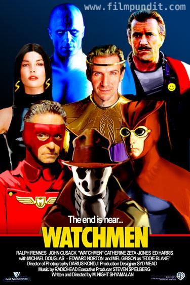

# Watchmen
## 2003/01/27 17:34

Evidence of the unique fervour of <i>Watchmen</i> fans can be found in
various Internet newsgroups and websites. One dedicated fan has even
produced this mock-up of a <i>Watchmen</i> movie poster. Pictured in
the poster are Ed Harris, Mel Gibson, Ralph Fiennes, John Cusack,
Edward Norton, Michael Douglas and Catherine Zeta Jones.If you look
really closely you may notice Danny Elfman listed as Composer and
M. Night Shyalaman listed as Director in the credits.

Comic fandom was abuzz this year with the news that Watchmen
would soon be adapted for the big screen. Watchmen, written by
Alan Moore and first published 17 years ago has been in - what
Hollywood calls - development hell since it's inception. Watchmen
won't be the first Hollywood adaptation of Moore's work ('From Hell'
and the forthcoming 'League of Extraordinary Gentlemen' starring Sean
Connery are both comic-book adaptations) but it is certainly the most
eagerly anticipated.

Watchmen is rightly regarded as the <i>Citizen Kane</i> of comic
books. It is a comic book that uses the format to full effect and on
first reading will most likely change forever your ideas of what comic
books are capable of.Comic books in the eighties appeared to grow up
with the release of adult-oriented titles. The reality was (and still
is today) that these adult-oriented titles were the equivalent of
alcho-pops compared to the fizzy soda of traditional comic books like
X-Men and Spiderman. They were superhero comics dressed up in more
titilating costumes.

Watchmen - on the other hand - is the heady wine of comic books. It
tells a rich and complex multi-layered story. It is both a history of
comic books and an alternative history of America from the 40's to the
80's. It is a story told by a writer at the height of his powers. The
fact that the story is told in comic book format becomes incidental
and yet it is a story which cannot be told in any other way.

Relative newcomer David Hayter (X-Men screenplay) has been tapped to
write and direct the eagerly awaited adaptation. Hayter isn't the
first to assume this role. The Watchmen project is regarded as
something of a  poison chalice in Hollywood, having passed through
many hands including at one time Terry Gilliam's (The FisherKing, 12
Monkeys). Gilliam is a close friend of Alan Moore's and was keenly
interested in the project. Moore himself is said to have expressed
scepticism and disinterest at the prospect of a successful
adaptation. For whatever reasons, Gilliam withdrew from the project
and it lay dormant until the recent success of comic book adaptations
such as Spiderman. The prospect of a forthcoming Watchmen movie has
inspired fervent debates. Watchmen's most ardent fans argue that a
movie adaptation is pointless and couldn't possibly recreate the
special magic of a reading. On Internet newsgroups and fan websites,
speculation is rife about the Movie's cast and crew with some fans
going so far as to create mock-up movie posters (see inset).

With the success of X-Men, Spiderman and the critical acclaim affored
to 'Road to Perdition', Hollywood regards comic books as having come
of age. Audiences may finally be ready to see the mysoginistic,
fetishist and all-too-human superheros depicted in Watchmen. One thing
is certain - to be a success (with fans at least) Watchmen will need a
very smart script and a virtuoso director at the height of his powers
(someone like Martin Scorsese circa <i>Goodfellas</i>). David Hayter
has some very high expectations to live up to.

### 2004/11/23 18:14

Jude Law <a href="http://www.empireonline.co.uk/site/news/NewsStory.asp?news_id=16087">wants to play Ozymandias</a>

## You might also like

[Watchmen Annotations](http://theory.lcs.mit.edu/~wald/watchmen-index.html)

## Categories
Movies, Watchmen, Comics

