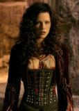

# Van Helsing
## 2004/05/14 22:45

When the 12-foot-tall Mr Hyde, in the middle of an almighty brawl,
stops to pull up his ragged pants over his "builder's crack", you know
this movie has its heart in the right place.  Which is more than can
be said for the main villain; Count Dracula. Dracula is played by
Richard Roxburgh who bears a striking resemblance to Bono from U2.
More Bela Lugosi than Christopher Lee, those who like their Dracula
fine-boned, may find Roxburgh's version a little 'Doughy'.
'Van Helsing' takes an ensemble of horror fiction characters and puts
them all together in the same time (and in some cases the same
time-zone).  The cast of characters includes a bleating well-meaning
Frankenstein lifted from Mel Brook's "Young Frankenstein".  This
Frankenstein moans endlessly and comes across like Harry Enfield's
well-meaning know-it-all "You don't want to do that!" Dad. Except he
isn't funny.  Also featured are: Dracula (with Brides), various
Werewolves and Dr. Jekyll/Mr Hyde.
Hugh Jackman plays Van Helsing, a supernatural bounty hunter hired by
the Vatican. He is dispatched to Transylvania to protect the last line
of the 'Valerious' family. Enter Kate Beckinsale as Anna
Valerious. Miss Beckinsale enters by the rear. Her rear to be
exact. The camera lingers on her svelte behind just long enough to get
your attention before panning up to her impossibly corsetted body and
alabaster face. Needless to say: Beckinsale is easily the best thing
in this picture. Anna Valerious surely deserves a franchise of her
own.  Almost everyone in this movies speaks with a Transylvanian
accent - even the vatican cardinals, but noone looks like they're
having so much fun with it as Kate Beckinsale. Tongue firmly in cheek,
her speech is a lurid purr that could break into giggles at any
moment. In contrast, Jackman's 'Van Helsing' character is bland and
derivative. Think James Bond with a crucifix, or Indiana Jones with a
silver crossbow, or better still: don't give it much thought at all.
With a weak hero, an equally weak villain and not nearly enough
screen-time for Kate beckinsale, the task of pulling the fat out of
the fire falls to the special effects. The over-reliance on special
effects is Van Helsing's main problem. Some of it is very good (the
werewolves for instance), but the human characters perform superhuman
acrobatic feats a-la-spiderman. There's nothing awe inspiring in
watching computer-generated swashbuckling. I hate to be a nerd about
this but, until the physics is right; the momentum, mass and gravity
is pitch-perfect; directors should steer clear of CGI. We may have
only been studying physics for the past 500 years but we've been
grappling with physics since the dawn of time. Our innate sense of how
the physical world operates is etched deep into our collective
lizard-brain and it can't be easily fooled.
The trailer for 'Van Helsing' does a pretty decent job of showing the
movie's wares. You see many (but not all) of the 'money shots' and you
see the following dialog between Beckinsale's "Anna Valerious" and
Jackman's "Van Helsing"...
> Anna Valerious (purring) : Some say you are a murderer, others say you are a priest - which is it ?  
> Van Helsing: A little bit of both really  
Hearing this snippet of rancid corn, you will come to one of two conclusions...
 1. This is rancid corn and there is no way I'm paying money to see this hokum.
 2. This is rancid corn but it looks like it could be a lot of fun anyway.
Choose wisely young grasshopper.
## Categories
Movies
