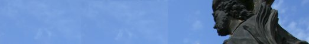
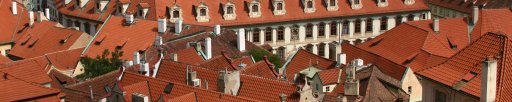
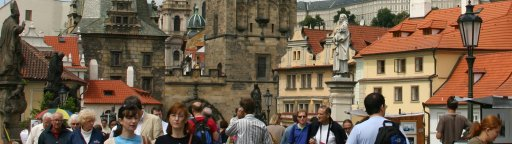
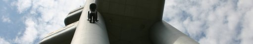
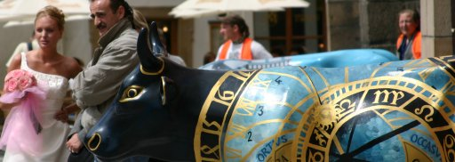
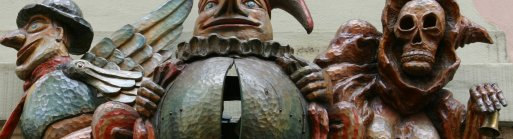
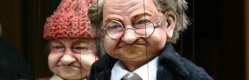
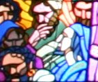
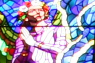
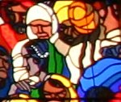

# Prague 2004
## 2004/07/15 09:00

Life is good when you can wake up in your own bed in Cork at 5:30am
and 5 hours later have breakfast at a terraced cafe near the charles
bridge in Prague. I find it hard to take this for granted. Perhaps I'd
be more jaded if I travelled more often - I don't know. Despite being
fleeced by the taxi driver (30 euro for a 17km taxi ride from the
airport to our hotel in Wencelsas square) we were in good spirits all
day. 

We spent much of the day walking and sightseeing. The charles bridge
is said to be one of the most romantic places in the world. This would
be true if all the tourists would just stay at home (which reminds of
an onion headline "90% of motorists believe others should leave car at
home"). It was tuesday so at least there weren't any english stag
parties chanting "Only the crumbliest..." as we shuffled our way
across the bridge.

On the first day we headed out early and had breakfast (with beer -
czech beer is beautiful, nothing like the beer back home) and wandered
around stumbling (figuratively - we didn't have that much beer) upon
the tourist spots. As we crossed the charles bridge there was a film
crew and a czech porn star just a couple of yards ahead of us. 

The porn star was being filmed (for what must have been the movie's
needless pre-amble) gazing wistfully across the river.At least I think
thats what it was - she looked like she was trying to emote a feeling
that was somewhere between wistful and horny. The nuance will probably
be lost on her intended audience - though maybe not: this is, after
all, the country that spawned intellectual heavyweights like Franz
Kafka and Milan Kundera. She must have been somewhat famous because
some locals stopped her for a photograph.She had had a lot of work
done to herself. 

We were hassled by a drunk as we were dropped off at the hotel so we
left the camera in our room on the first day.While those looking for
pictures of czech porn stars may be disappointed we had no camera, the
next day we did take some pictures on the bridge. On day 2, equipped
with 3-day metro passes and expensive western digital camera with bag
and accessories we started taking our sightseeing seriously.

First stop was the TV Tower: Pragues tallest manmade structure. As you
approach the tower from one of the many narrow streets you notice the
tower is adorned with 10ft-high faceless metallic babies who appear to
be crawling and playing around the enormous structure. While some
might find this image a little disturbing, I for one welcome our
metallic giant baby overlords.

A wedding in the old town square attracted a lot of attention from the
tourists who stood agape at the foot of an old church with steeples
stolen from the set of "Lord of the Rings". Like many cities on the
continent, Prague has some wonderful curiosity shops. Marionettes and
Medieval gear are big in Prague. Near the castle we took a rest at the
Franz Kafka cafe. At the next table were two englishmen. 

'They looked like "Dungeons & Dragons" nerds' I thought to myself (it
takes one to know one). In short order one of the D&D nerds produced
from a plastic bag, a 4ft long medieval sword he had just purchased in
a nearby shop, and brandished it playfully. How/If he got it through
the airport - I don't know. 

On the grounds of the castle is an impressive cathedral with beautiful
enormous stained glass windows. It really has to be seen to be
believed. 

  
  
  

A short 5 minute walk from the castle is a buddhist restaurant - can't
recall the name - that serves decent vegetarian food for next to
nothing. Highly recommended, but give the ginseng wine a miss if you
value your taste buds.

(All images copyright &copy; Ursula Galvin 2004)

## Categories
Travel

