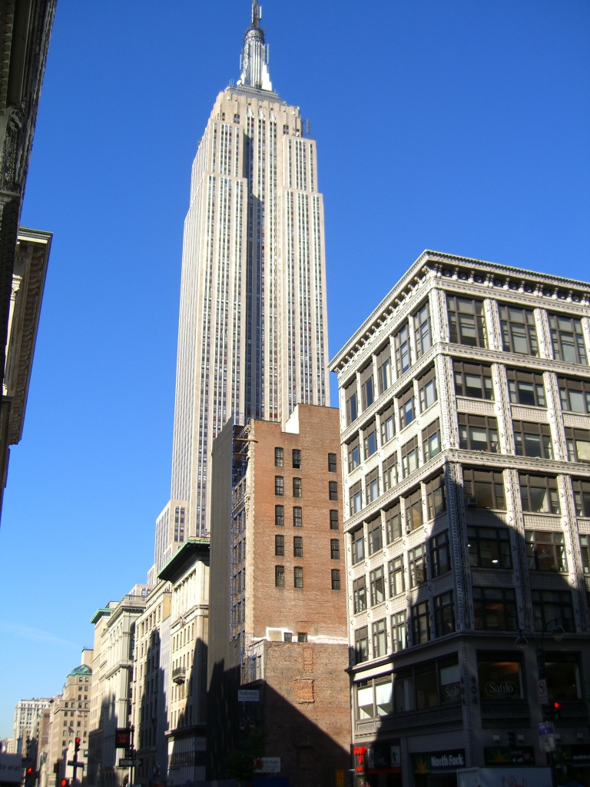
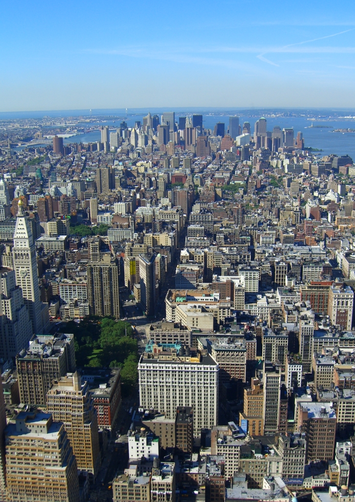
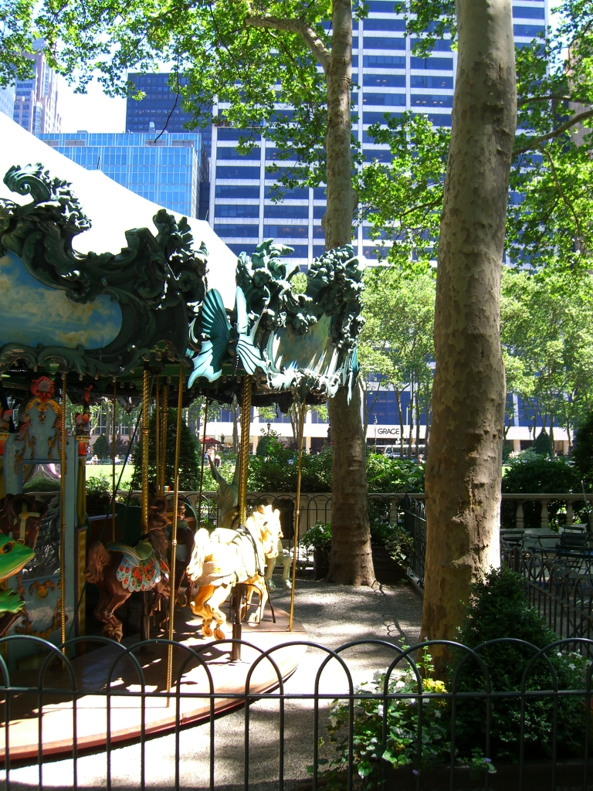
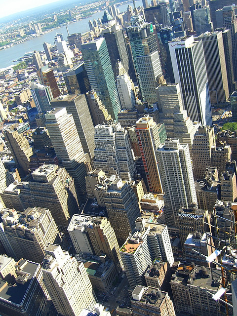

# New York June 2005
## 2005/06/27 08:00

Being possibly the only irishman over the age of 30 who has never been
to New York, I found myself armed with a new 7.2 Megapixel camera and
a few furtive hours to kill. 

There isn't really anything I can say about New York that hasn't
already been said. It was prettier than I expected. The city and its
inhabitants are beautiful and/or interesting. 

We left Whippany New Jersey at 6:50am and got into new york by
8:30. My first stop was, predictably, the Empire State building. From
there I took a stroll down broadway, took a rest in Bryant Park then
headed on to Central Park west along 5th avenue.

Bryant Park is a wi-fi oasis in the heart of the city. 

Needless to say, the viewing deck of the Empire State building provides some breathtaking views.

More [New York pictures...](images/xanadb/newyork/)

## Categories
Travel

